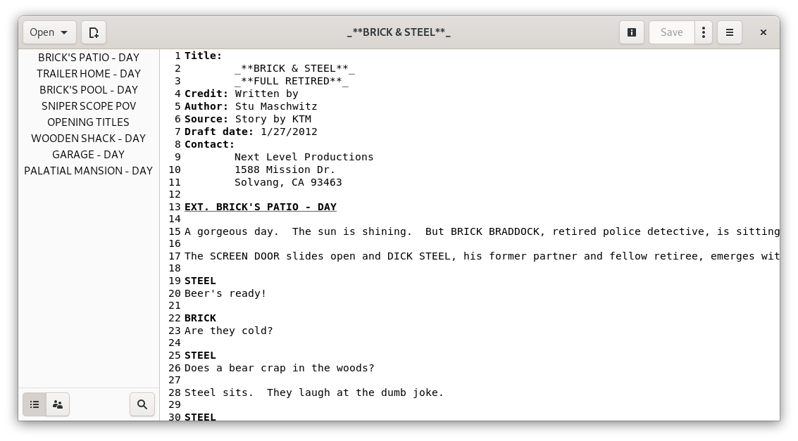

<h1 align="center">
	 
 Stories Typer
</h1>

<strong>Screenwriting software for GNOME</strong>

# ADVICES
THIS IS PROOF OF CONCEPT SOFTWARE FAR FROM USABLE.
PLEASE DON'T OPEN ISSUES FOR THINGS WE ALL KNOW ARE BROKEN.
CURRENT CODE IS SHITTY AND DIRTY.

# Roadmap
- **v0.1**
    - [ ] Open, edit and save fountain text files
    - [ ] List Scenes and characters 
    - [ ] Basic editor preferences
- **v0.2**
    - [ ] Autocompletion for screenplays syntax and characters names
    - [ ] Export to PDF
    - [ ] Implement editor search
- **First major release**
    - [ ] Implement WYSIWYG screenplays editor
    - [ ] Import from other screenplay formats (.fdx, .celtx, .astx, .fadein, LaTeX)
    - [ ] Export to more visualization formats (formatted text, HTML & RTF)
    
# Installation
This app is written to be Flatpak only. The easiest way to test **Stories Typer** is cloning this repo with **GNOME Builder** and run it from there.

# Credits
Developed by Rafael Mardojai CM.
I have used/modified code from [UberWriter](https://github.com/UberWriter/uberwriter) and [Zim](https://github.com/zim-desktop-wiki/zim-desktop-wiki) to learn about Gtk/Python text creation apps.

